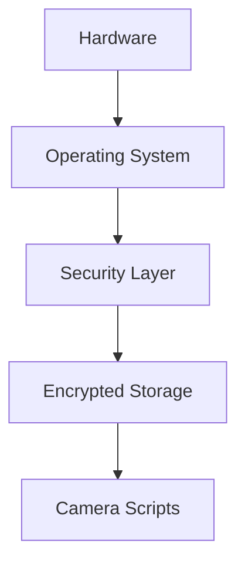
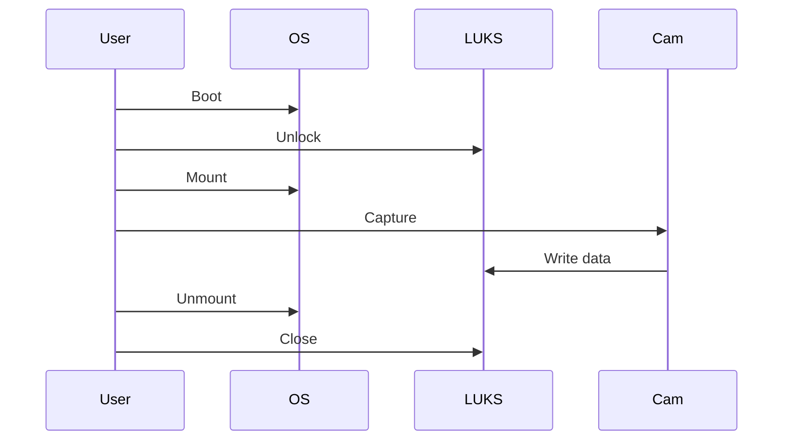
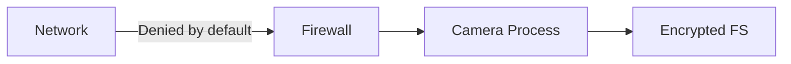

# ARCHITECTURE.md
## Rasp AI Camera (AICAM / Rasp)

---

## 1. Intent and Educational Scope

This document is the **canonical architectural reference** for the Rasp AI Camera project.

It is written to:
- Fully describe *what exists today*
- Explain *why each design choice was made*
- Educate technically literate readers on secure embedded Linux system design
- Serve as a long-term maintenance and audit reference

This is **not marketing documentation** and **not a quick-start guide**.

---

## 2. System Goals

Primary goals:
- Data-at-rest confidentiality
- Minimal and controllable attack surface
- Explicit operator intent
- Predictable failure modes
- Clear trust boundaries

Secondary goals:
- Maintainability
- Educational clarity
- Portability to similar embedded systems

---

## 3. Non-Goals (Hard Constraints)

The system intentionally does **not** aim to:
- Be cloud-native
- Stream continuously
- Be unattended by default
- Optimize for ease-of-use over security
- Hide complexity from the operator

---

## 4. Layered Architecture Overview

The system is structured into **strict layers**:

1. Hardware Layer  
2. Operating System Layer  
3. Security Layer  
4. Storage Layer  
5. Application Layer  

Each layer depends only on layers below it.

---

## 5. Hardware Layer

**Components**
- Raspberry Pi (ARM SoC)
- Camera (CSI or USB)
- External USB storage (HDD/SSD)

**Threat Assumptions**
- Device can be stolen
- Storage can be removed
- Physical access ≠ trust

No security property relies on physical secrecy.

---

## 6. Operating System Layer

**OS**
- Raspberry Pi OS (Debian-based)

**Design Characteristics**
- Minimal services enabled
- No implicit background daemons for capture
- Manual execution preferred
- Standard Linux privilege model assumed untrusted by default

The OS is treated as a **control surface**, not a trusted enclave.

---

## 7. Security Layer (Defense in Depth)

### 7.1 Network Boundary – Firewall

**Tool**
- UFW (iptables backend)

**Baseline Policy**
- Default deny incoming
- Default deny outgoing
- Explicit allow rules only

**Rationale**
Outbound connections are treated as potential data exfiltration paths.
The device is not assumed to be a general-purpose network participant.

RFC1918 private address ranges are blocked by default (commented for flexibility).

---

### 7.2 Mandatory Access Control – AppArmor

**Role**
- Constrain camera scripts
- Limit filesystem reach
- Reduce post-compromise impact

**Design Rules**
- Profiles are narrow
- Scripts are treated as hostile until proven otherwise
- MAC complements DAC, never replaces it

---

## 8. Storage Layer (Data at Rest)

### 8.1 Encrypted Storage

**Technology**
- LUKS2 (dm-crypt)

**Configuration**
- Cipher: AES-XTS
- Key size: 512-bit
- PBKDF: Argon2id

**Security Properties**
- Disk confidentiality if removed
- No plaintext persistence when closed
- Strong offline attack resistance

---

### 8.2 Mount Lifecycle

Storage is **not assumed to be always available**.

Lifecycle:
1. `cryptsetup open`
2. Filesystem mount
3. Capture operations
4. Unmount
5. `cryptsetup close`

**Directory Layout**
```
/media/user/disk/
├── images/
└── videos/
```

Applications must fail safely if storage is unavailable.

---

## 9. Application Layer (Camera Pipeline)

### 9.1 Camera Scripts

**Components**
- Shell scripts (`rpicam*.sh`)
- Optional Python helpers

**Execution Properties**
- Fail-fast (`set -euo pipefail`)
- No silent degradation
- Explicit invocation

---

### 9.2 Responsibility Boundaries

Camera scripts:
- Control capture only
- Write only to encrypted storage
- Do not manage networking
- Do not manage security state

---

## 10. Operational Narrative (Default)

1. Boot system
2. Unlock encrypted disk
3. Mount filesystem
4. Execute capture scripts
5. Validate output
6. Unmount filesystem
7. Close encrypted container
8. Power down or idle

No step is hidden or automated without explicit operator intent.

---

## 11. Trust Model

| Component | Trust Level |
|--------|-------------|
| Hardware | Low |
| OS Kernel | Medium |
| Userland | Low |
| Camera Scripts | Low |
| Encrypted Storage | High |

Cryptography is trusted more than software complexity.

---

## 12. Failure Philosophy

Failures are:
- Loud
- Immediate
- Non-recovering by default

Silent fallback is treated as a vulnerability.

---

## 13. Diagram-Oriented View

### Layer Diagram


---

### Data Flow Diagram


---

### Security Boundary Diagram


---

## 14. Current Status

**Implemented**
- Encrypted storage
- Hardened firewall baseline
- Explicit capture scripts
- Manual operational model

**Optional / In Progress**
- AppArmor profile refinement
- Opt-in boot automation
- Logging and integrity checks

---

## 15. Architectural Philosophy

Explicit > Implicit  
Manual > Automatic  
Auditable > Convenient  
Documented > Assumed  

This architecture is intentionally conservative, instructional, and hostile-environment aware.
