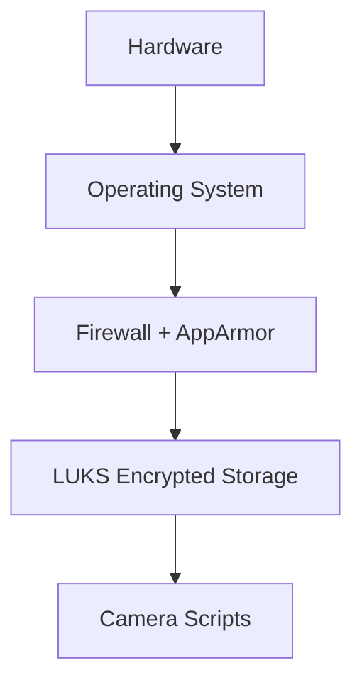

🧠 **ARCHITECTURE.md — Canonical, Educational Edition**
Rasp AI Camera (AICAM / Rasp)

---

## Why This Document Exists

This file is intentionally **dense, opinionated, and explanatory**.

It is meant to:
- Teach secure embedded Linux architecture
- Explain *why* choices were made, not just *what* was done
- Serve as a long-term reference for future-you and future reviewers
- Act as a design anchor so the project does not drift into accidental complexity

If you are reading this casually, expect friction.  
If you are reading this to *understand*, everything is here.

---

## Mental Model First (Read This Once)

Think of this system as:

> **A hostile-environment data recorder that only does what it is explicitly told to do.**

Not:
- A smart camera
- A service
- A cloud node
- An appliance

It is a **controlled instrument**.

---

## Core Design Pillars

🧱 **Explicit Control**  
🔐 **Cryptography over Obscurity**  
🔥 **Fail Loud, Fail Early**  
🧭 **Operator Intent > Automation**  
📚 **Documented > Remembered**

Every decision traces back to one of these.

---

## Threat Assumptions (Non-Negotiable)

We assume:
- Physical access is possible
- Disks can be stolen
- Networks are hostile
- Software fails
- Convenience creates vulnerabilities

We do **not** assume:
- Trusted local networks
- Benign users
- Continuous connectivity
- Perfect code

---

## Layered Architecture (Strict)

```
Human Intent
────────────
Application Layer (Camera Scripts)
────────────
Storage Layer (Encrypted FS)
────────────
Security Layer (Firewall + MAC)
────────────
Operating System
────────────
Hardware
────────────
Physical Reality (Untrusted)
```

Layers only depend downward.  
No layer gets to “cheat.”

---

## Hardware Layer 🧩

**Components**
- Raspberry Pi (ARM SoC)
- CSI or USB Camera
- External USB HDD/SSD

**Key Insight**
> If stealing the device compromises the data, the architecture has already failed.

This is why encryption is mandatory, not optional.

---

## Operating System Layer 🐧

**OS**
- Raspberry Pi OS (Debian-based)

**Philosophy**
The OS is *capable*, not *trusted*.

We:
- Minimize services
- Avoid magic startup behavior
- Prefer manual invocation
- Treat userland as hostile by default

The OS is a **platform**, not a boundary.

---

## Security Layer 🛡️ (Defense in Depth)

### Firewall — Network Is a Liability

**Tool**
- UFW (iptables)

**Baseline**
- Deny all incoming
- Deny all outgoing
- Explicit allow only

Why outbound deny?
Because **exfiltration is worse than intrusion**.

DNS, HTTP, HTTPS are *exceptions*, not rights.

---

### Mandatory Access Control — AppArmor

**Why MAC exists**
If a camera script is compromised, it should:
- Not read arbitrary files
- Not open random devices
- Not explore the filesystem

**Rule**
> UNIX permissions say *who* can do something.  
> MAC says *what they are allowed to touch*.

---

## Storage Layer 🔐 (Data at Rest Is Sacred)

### Encryption (LUKS2)

**Configuration**
- AES-XTS
- 512-bit key
- Argon2id PBKDF

**Property**
When closed:
- The disk may as well be random noise.

There is no “mostly secure” state.

---

### Mount Lifecycle (Important)

Storage is **ephemeral by design**.

1. Unlock explicitly
2. Mount explicitly
3. Use explicitly
4. Unmount explicitly
5. Close explicitly

This prevents:
- Accidental writes
- Background leakage
- Forensic surprises

---

## Application Layer 📸 (Camera Pipeline)

### Scripts, Not Services

Camera logic lives in:
- Shell scripts
- Optional Python helpers

Why scripts?
- Transparent execution
- Easy audit
- Predictable failure

### Fail-Fast Rule

```bash
set -euo pipefail
```

If something is wrong, stop.  
Silent success is dangerous.

---

## Operational Narrative 🧭 (The Golden Path)

1. Boot system
2. Unlock encrypted disk
3. Mount filesystem
4. Capture images/videos
5. Verify output
6. Unmount filesystem
7. Close encrypted container
8. Power down or idle

Nothing happens “just because.”

---

## Trust Model 🧠 (Read Carefully)

| Component | Trust |
|--------|------|
| Hardware | Low |
| OS Kernel | Medium |
| Userland | Low |
| Scripts | Low |
| Cryptography | High |

If something must be trusted, prefer **math over software**.

---

## Failure Philosophy 🔥

Failures must be:
- Immediate
- Visible
- Irreversible without intent

Automatic recovery hides problems.  
Hidden problems become breaches.

---

## Diagram View (Reinforcement)



---

## What This Architecture Teaches

- Security is subtraction, not addition
- Automation is a liability unless justified
- Documentation is a security control
- If you cannot explain it, you do not control it

---

## Status

✔ Encrypted storage  
✔ Hardened firewall  
✔ Manual execution model  
✔ Educational clarity  

Optional:
- AppArmor tightening
- Threat model appendix
- Operations manual

---

## Final Principle

> **If future-you forgets why this exists, this document should remind them.**
